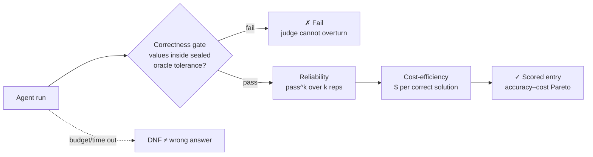

# Caliber-1

**The benchmark for autonomous hard-science research agents** — a small, curated set of brutal
**chemistry, physics, and materials** commissions that today's best agents can't yet ace.
Few tasks. Each one hard. Every grade verified.

[](https://github.com/fl-sean03/caliber/actions/workflows/ci.yml)
[](LICENSE)
[](https://www.python.org/)
[](#-status)
[](benchmark/METHODOLOGY.md)

**Quick links:** [📋 The tasks](#-the-tasks) · [⚖️ How grading works](#-how-grading-works) · [🔬 Why trust a grade](#-why-trust-a-grade) · [🚦 Status](#-status) · [📖 Full methodology](benchmark/METHODOLOGY.md) · [🗺️ Repo map](#-repo-map)

Caliber-1 grades agents on **real research outcomes** — converged DFT/MD calculations, verified
physical properties, multi-stage campaigns, bounded discovery — not multiple-choice questions.
What makes it worth trusting is the **method**: ground truth is computed, not asserted;
task validity is adversarially screened; graded runs are sealed and audited; and every score
decomposes into correctness, reliability, and cost. It is deliberately **lean** (~30 tasks —
a hard **core of 10** plus breadth across the hard-science space) and it is being built to
**launch unsaturated**: Caliber-1 releases only once frontier models at maximum effort *can't*
ace it.

---

## 📋 The tasks

Each task is a **research commission**: a hard physical question plus a compute environment.
The agent must pick a method, justify it, run the actual calculation, quantify uncertainty,
and report structured values. **Prompts are public; answers, tolerances, and canaries are
sealed** in a separate private store.

Caliber-1 is **~30 commissions**, organized by **domain** and **difficulty horizon** — not by
count. Hardness comes from *depth* (coupled multi-stage research), not from piling on shallow
tasks:

| | Chemistry | Physics | Materials |
|--|--|--|--|
| **Core (10)** — the brutal headline (horizon H5–H7: long campaigns → bounded discovery) | ▉▉▉ | ▉▉▉ | ▉▉▉▉ |
| **Breadth (20)** — comprehensive coverage (H4–H6) | ▉▉▉▉▉▉ | ▉▉▉▉▉▉ | ▉▉▉▉▉▉▉▉ |

> **Example commission** (style — the released set is in authoring):
>
> *"Ag–Cu is a classic binary alloy system. Determine whether silver and copper **mix** or
> **phase-separate** when forced into a random solid solution, and quantify the enthalpy of
> mixing of a random Ag₀.₅Cu₀.₅ solid solution relative to the pure FCC elements. Choose your
> own method and justify it. Report a value with an uncertainty, state the **sign** explicitly,
> and note any known limitation of your chosen method for this system."*
>
> Caliber-1's tasks are considerably harder than this — multi-stage campaigns, model-adequacy
> landmines, and bounded discovery graded against a high-compute oracle.

→ Public prompts for the development set: [`benchmark/suite/`](benchmark/suite/)

## ⚖️ How grading works

Every run is scored on **three orthogonal axes** — a frontier agent can be
correct-but-unreliable or correct-but-ruinously-expensive:



1. **Correctness gate (binary)** — load-bearing quantities must land inside sealed per-task
   tolerances. Mechanical and judge-independent; a frozen process judge scores *how* the work
   was done but can **never overturn the gate**.
2. **Reliability — pass^k** — the probability of passing **all** *k* independent reps.
3. **Cost-efficiency** — dollars and tokens **per correct solution**.

Results will report more than pass rates: each model gets a **failure profile** — where on the
difficulty horizon it breaks, *how* it fails (wrong method, unconverged calculation, silent
unit error, gave up, blew the budget), and how that decomposes across domains. A benchmark
this small can afford to diagnose, not just rank.

## 🔬 Why trust a grade

Caliber's claim to credibility is that every step between "agent run" and "score" is
verifiable machinery, not judgment calls:

- **Oracle-escrow ground truth.** The grader *computes* each reference answer at **10–100×
  the agent's budget** (tighter convergence, denser sampling, quantified finite-size and
  statistical error). Tolerances are derived from the **reference's own uncertainty** — never
  a global epsilon, never an LLM's opinion, never the agent's own numbers.
- **Adversarial task validation.** Every candidate task is screened against a panel of
  frontier models at maximum effort before it can enter the suite. Tasks a model can ace are
  discarded; tasks with ambiguous or unfair constructions are caught by cross-model
  disagreement analysis and fixed or dropped.
- **Environment sealing + trajectory audit.** Graded runs block lookups of the exact target;
  every transcript is replayed against the task's environment contract
  ([`benchmark/suite/trajectory_audit.py`](benchmark/suite/trajectory_audit.py)) to detect
  *retrieving* a graded quantity instead of deriving it. Retrieval → VOID, distinct from FAIL.
- **Provenance-verified runs.** Full trajectories (every tool call, per-turn cost), harness
  identity (`harness:{name,version,config_hash}`), and a PROV-typed provenance graph are
  captured for every run — a leaderboard entry is always traceable to exactly what produced it.
- **Three-axis scoring.** Correctness gate × pass^k reliability × cost per correct solution —
  no single-number scores that hide reliability collapse or ruinous cost.

## 🚦 Status

**Caliber-1 is in active development — not yet released.** It ships only when it clears its
**release gate**: the best frontier models at maximum effort land **~15–40%** on the
correctness gate, with clear separation between models and pass^k well below 1 — *brutal but
cracking*, with multi-year headroom.

Authoring follows the FrontierMath funnel: propose hard candidates → **screen against the
frontier panel at max effort → keep only the tasks they can't ace** → iterate to a
collectively-unsaturated ~30 (core 10 first).

A 17-task **development/calibration set** was run first and was *saturated* by a frontier model
(8/8 graded frontier tasks passed) — that result is exactly why Caliber-1 aims higher; those
tasks are demoted to development evidence, not the release. See
[benchmark/DEVELOPMENT.md](benchmark/DEVELOPMENT.md) for that data and what it taught us.

The official leaderboard opens when Caliber-1 freezes → [benchmark/LEADERBOARD.md](benchmark/LEADERBOARD.md).

## 🗺️ Repo map

```
caliber/
└── benchmark/
    ├── METHODOLOGY.md     # three axes · oracle-escrow grading · difficulty horizon · release gate
    ├── DEVELOPMENT.md     # calibration results + the saturation finding that set the bar
    ├── LEADERBOARD.md     # opens when Caliber-1 freezes
    ├── TASK_VERSIONING.md # per-task N-X versions · frozen-suite comparability
    ├── suite/             # public task manifests (prompts + reporting keys) + sweep/audit tools
    ├── scoring/           # mechanical anchors ⊕ frozen judge · evidence store · provenance graph
    └── harnesses/         # per-model native runners (native-claude / native-codex / native-grok)
```

Sealed answers, tolerances, and the held-out set live in a **separate private repository**
(`caliber-private`) — never here.

## 🚀 Run it

```bash
git clone https://github.com/fl-sean03/caliber.git && cd caliber
pip install pytest requests

python -m pytest benchmark/scoring -q                       # verify the scoring engine
python benchmark/suite/native_sweep.py --reps 3 --lanes 3   # sweep a model on its native harness
python benchmark/suite/native_audit.py <run_dir> --brief    # audit a completed run
```

## 🔒 Public methodology, private answers

Everything about *how* Caliber grades is open; the sealed reference values, tolerances, grading
keys, and a never-published held-out set live in a separate private repo, injected only at
grade time. This is the standard contamination model (ARC-AGI, SWE-bench Pro): public tasks can
be tuned against, the held-out set cannot, and every entrant is scored through the same public
submission path with the same Verified review.

## Contributing

Task proposals, harnesses, and submissions: [CONTRIBUTING.md](CONTRIBUTING.md) ·
[CODE_OF_CONDUCT.md](CODE_OF_CONDUCT.md) · [SECURITY.md](SECURITY.md).

## Citing

```bibtex
@software{florez_caliber1_2026,
  author  = {Florez, Sean},
  title   = {Caliber-1: a benchmark for autonomous hard-science research agents},
  year    = {2026},
  url     = {https://github.com/fl-sean03/caliber},
  license = {MIT}
}
```

## License

MIT — see [LICENSE](LICENSE). Sealed benchmark content is not part of this repository.
