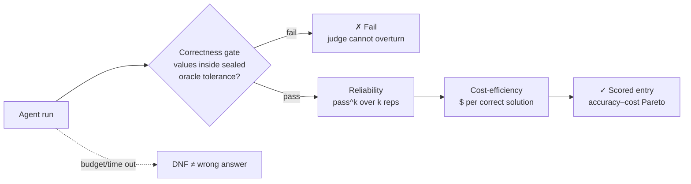

# Caliber

**A benchmark for autonomous computational-materials-science agents** — does the agent
choose a sound method, run the *real* calculation, verify its own numbers, and report them
honestly, reliably, and efficiently?

[](https://github.com/fl-sean03/caliber/actions/workflows/ci.yml)
[](LICENSE)
[](https://www.python.org/)
[](benchmark/METHODOLOGY.md)

**Quick links:** [📋 The tasks](#-the-tasks) · [⚖️ How grading works](#-how-grading-works) · [📊 Results](#-results) · [🏆 Leaderboard](benchmark/LEADERBOARD.md) · [📖 Full methodology](benchmark/METHODOLOGY.md) · [🗺️ Repo map](#-repo-map)

Caliber grades agents on **real research outcomes** — converged DFT/MD calculations,
verified physical properties, multi-stage campaigns — not multiple-choice questions. It also
includes the **capability core** (`skills/`, `AGENTS.md`) that turns a coding agent into an
autonomous computational researcher: the system under test, developed in the open.
*(Formerly the Agentic Science Worker.)*

---

## 📋 The tasks

Each task is a **research commission**: a physical question plus a compute environment. The
agent must pick a method, justify it, run the actual calculation, quantify uncertainty, and
report structured values. **Prompts are public; answers, tolerances, and canaries are
sealed** in a separate private store.

> **BENCH-B-001** · cluster `alloy-thermo` · targets: method-selection, error-detection, uncertainty
>
> *"Ag–Cu is a classic binary alloy system. Determine whether silver and copper **mix** or
> **phase-separate** when forced into a random solid solution, and quantify the enthalpy of
> mixing of a random Ag₀.₅Cu₀.₅ solid solution relative to the pure FCC elements. Choose your
> own method and justify it. Report a value with an uncertainty, state the **sign**
> explicitly, and note any known limitation of your chosen method for this system."*

Tasks are organized into **bands** (how much of the method is given) and a difficulty
**horizon** (how many coupled stages the task requires):

| Band | # | What it isolates |
|------|--:|------------------|
| **B — underspecified-hard** | 8 | The recipe is removed — *method selection is the task*. |
| **C — frontier commissions** | 9 | Multi-observable research: consistency, uncertainty, decision-making, model-adequacy. |

→ **Browse every public prompt:** [`benchmark/suite/batch1/MANIFEST.json`](benchmark/suite/batch1/MANIFEST.json)

## ⚖️ How grading works

Every run is scored on **three orthogonal axes** — a frontier agent can be
correct-but-unreliable or correct-but-ruinously-expensive:



1. **Correctness gate (binary)** — load-bearing quantities must land inside sealed per-task
   tolerances. Mechanical and judge-independent; a frozen process judge scores *how* the
   work was done but can **never overturn the gate**.
2. **Reliability — pass^k** — the probability of passing **all** *k* independent reps (not a
   lucky pass@k).
3. **Cost-efficiency** — dollars and tokens **per correct solution**, on an accuracy-vs-cost
   frontier.

Ground truth is an **oracle-escrow reference the grader computes at 10–100× the agent's
budget** — not experiment, not the agent's own numbers.
→ [Full methodology](benchmark/METHODOLOGY.md)

## 📊 Results

**Claude Fable 5** on the current slate (`caliber-2026.1-batch1`, single-rep reference):

| Band | Result |
|------|--------|
| **C — frontier commissions** | **8/8 graded PASS** on the correctness gate (judge 0.93–1.0); 1 harness-DNF pending clean re-run |
| **B — underspecified-hard** | **8/8 completed**, spot-validated against literature |

Correctness is **saturated** at the frontier — the normal fate of a static slate, and the
reason the next generation moves difficulty onto the stage-count horizon. Both robustness
**traps** (a poisoned input; a non-existent crystal phase) were caught, not fabricated.

→ **Full per-task results, costs, and the saturation analysis:** [benchmark/RESULTS.md](benchmark/RESULTS.md)

### 🏆 Leaderboard

Official entries are published only for **frozen generations**, on the full three-axis
profile — never single-rep pass rates:

| Rank | Agent (harness) | Generation | Gate | pass^k | $ / correct | Verified |
|-----:|-----------------|------------|:----:|:------:|:-----------:|:--------:|
| — | *No entries yet* | `caliber-2026.2` | — | — | — | — |

*`caliber-2026.1-batch1` is the frontier-saturated regression floor and is not ranked.*
→ [Leaderboard & submission rules](benchmark/LEADERBOARD.md)

## 🗺️ Repo map

```
caliber/
├── benchmark/           # ← THE BENCHMARK
│   ├── METHODOLOGY.md   #   three axes · oracle-escrow grading · difficulty horizon
│   ├── RESULTS.md       #   per-task reference results + saturation analysis
│   ├── LEADERBOARD.md   #   frozen-generation results + submission rules
│   ├── suite/           #   public task manifests (prompts + reporting keys) + sweep/audit tools
│   ├── scoring/         #   mechanical anchors ⊕ frozen judge · evidence store · provenance graph
│   └── harnesses/       #   per-model native runners (native-claude/; more over time)
├── skills/              # ← THE CAPABILITY CORE (17 science skills the agents use)
├── AGENTS.md            #   the agent operating contract
├── docs/  examples/  showcases/  configs/  environments/
```

Sealed answers, tolerances, and the held-out verification slate live in a **separate
private repository** (`caliber-private`) — never here.

## 🚀 Run it

```bash
git clone https://github.com/fl-sean03/caliber.git && cd caliber
conda env create -f environments/science-tools.yml   # or: pip install pytest requests

# 1. verify the scoring/evidence/provenance engine
python -m pytest benchmark/scoring -q

# 2. sweep a model across the sealed task set on its native harness
python benchmark/suite/native_sweep.py --reps 3 --lanes 3

# 3. audit a completed run (wake pattern, cost anatomy, artifact integrity)
python benchmark/suite/native_audit.py <run_dir> --brief
```

To run the **agent** itself, point any supported coding agent (Claude Code, Aider, Cursor)
at `AGENTS.md` and give it a research prompt — e.g. *"Calculate the self-diffusion
coefficient of liquid argon at 94 K."* See [the capability core](#the-capability-core-skills).

## 🔒 Public methodology, private answers

Everything about *how* Caliber grades is open; the sealed reference values, tolerances,
grading keys, and a never-published held-out slate live in a separate private repo, injected
only at grade time. This is the standard contamination model (ARC-AGI, SWE-bench Pro): public
tasks can be tuned against, the held-out slate cannot, and every entrant — including our own
agent — is scored through the same public submission path with the same Verified review.

## The capability core (`skills/`)

The agents Caliber grades are built from a portable capability layer: 17 self-contained
**skills** (`skills/<name>/SKILL.md`) spanning simulation (LAMMPS, Quantum ESPRESSO, MLIPs),
compute discipline (strategy, validation, long-compute, campaign orchestration), knowledge
(literature, materials databases, force-field parameters), and execution (cloud GPU, data
analysis). An agent reads `AGENTS.md` as its operating contract and composes skills on
demand. See [Showcases »](showcases/) for worked examples.

## Contributing

Task proposals, new harnesses, and leaderboard submissions: see
[CONTRIBUTING.md](CONTRIBUTING.md). Be excellent to each other:
[CODE_OF_CONDUCT.md](CODE_OF_CONDUCT.md). Security / sealed-content concerns:
[SECURITY.md](SECURITY.md).

## Citing

```bibtex
@software{florez_caliber_2026,
  author  = {Florez, Sean},
  title   = {Caliber: autonomous computational materials science agents and the
             benchmark that measures them},
  year    = {2026},
  url     = {https://github.com/fl-sean03/caliber},
  license = {MIT}
}
```

## License

MIT — see [LICENSE](LICENSE). Sealed benchmark content is not part of this repository.
