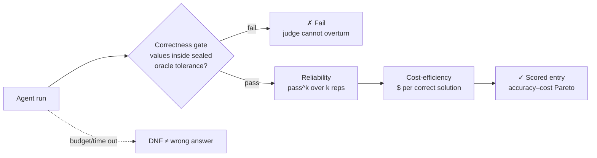

# Caliber

**A benchmark series for autonomous hard-science research agents** — small, curated sets of
brutal **chemistry, physics, and materials** commissions that today's best agents can't yet
ace. Few tasks. Each one hard.

**Caliber-1** is the first suite in the series: the first rigorously-built benchmark for this
domain. Later suites are added over time, as the frontier advances and coverage warrants.

[](https://github.com/fl-sean03/caliber/actions/workflows/ci.yml)
[](LICENSE)
[](https://www.python.org/)
[](#-status)
[](benchmark/METHODOLOGY.md)

**Quick links:** [📋 The tasks](#-the-tasks) · [⚖️ How grading works](#-how-grading-works) · [🚦 Status](#-status) · [📖 Full methodology](benchmark/METHODOLOGY.md) · [🗺️ Repo map](#-repo-map)

Caliber grades agents on **real research outcomes** — converged DFT/MD calculations, verified
physical properties, multi-stage campaigns, bounded discovery — not multiple-choice questions.
It is deliberately **lean**: ~30 tasks (a hard **core of 10** plus breadth across the
hard-science space), so you can measure a model with a handful of agent runs, not a fleet of
a hundred. The suite is being built to **launch unsaturated** — Caliber-1 releases only once
frontier models at maximum effort *can't* ace it.

*(Includes the **capability core** — the `skills/` + `AGENTS.md` that turn a coding agent into
an autonomous researcher; the system under test, developed in the open. Formerly the Agentic
Science Worker.)*

---

## 📋 The tasks

Each task is a **research commission**: a hard physical question plus a compute environment.
The agent must pick a method, justify it, run the actual calculation, quantify uncertainty,
and report structured values. **Prompts are public; answers, tolerances, and canaries are
sealed** in a separate private store.

Caliber-1 is **~30 commissions**, organized by **domain** and **difficulty horizon** — not by
count. Hardness comes from *depth* (coupled multi-stage research), not from piling on shallow
tasks:

| | Chemistry | Physics | Materials |
|--|--|--|--|
| **Core (10)** — the brutal headline (horizon H5–H7: long campaigns → bounded discovery) | ▉▉▉ | ▉▉▉ | ▉▉▉▉ |
| **Breadth (20)** — comprehensive coverage (H4–H6) | ▉▉▉▉▉▉ | ▉▉▉▉▉▉ | ▉▉▉▉▉▉▉▉ |

> **Example commission** (style — the released set is in authoring):
>
> *"Ag–Cu is a classic binary alloy system. Determine whether silver and copper **mix** or
> **phase-separate** when forced into a random solid solution, and quantify the enthalpy of
> mixing of a random Ag₀.₅Cu₀.₅ solid solution relative to the pure FCC elements. Choose your
> own method and justify it. Report a value with an uncertainty, state the **sign** explicitly,
> and note any known limitation of your chosen method for this system."*
>
> Caliber-1's tasks are considerably harder than this — multi-stage campaigns, model-adequacy
> landmines, and bounded discovery graded against a high-compute oracle.

→ Public prompts for the development set: [`benchmark/suite/`](benchmark/suite/)

## ⚖️ How grading works

Every run is scored on **three orthogonal axes** — a frontier agent can be
correct-but-unreliable or correct-but-ruinously-expensive:



1. **Correctness gate (binary)** — load-bearing quantities must land inside sealed per-task
   tolerances. Mechanical and judge-independent; a frozen process judge scores *how* the work
   was done but can **never overturn the gate**.
2. **Reliability — pass^k** — the probability of passing **all** *k* independent reps.
3. **Cost-efficiency** — dollars and tokens **per correct solution**.

Ground truth is an **oracle-escrow reference the grader computes at 10–100× the agent's
budget** — not experiment, not the agent's own numbers. → [Full methodology](benchmark/METHODOLOGY.md)

## 🚦 Status

**Caliber-1 is in active development — not yet released.** It ships only when it clears its
**release gate**: the best frontier models (GPT-5.6, Fable 5, Grok 4.5) at maximum effort land
**~15–40%** on the correctness gate, with clear separation between models and pass^k well below
1 — *brutal but cracking*, with multi-year headroom.

Authoring follows the FrontierMath funnel: propose hard candidates → **screen against the
frontier panel at max effort → keep only the tasks they can't ace** → iterate to a
collectively-unsaturated ~30 (core 10 first).

A 17-task **development/calibration set** was run first and was *saturated* by a frontier model
(8/8 graded frontier tasks passed) — that result is exactly why Caliber-1 aims higher; those
tasks are demoted to development evidence, not the release. See
[benchmark/DEVELOPMENT.md](benchmark/DEVELOPMENT.md) for that data and what it taught us.

The official leaderboard opens when Caliber-1 freezes → [benchmark/LEADERBOARD.md](benchmark/LEADERBOARD.md).

## 🧭 The Caliber Series

Caliber is a **series**, not a single frozen test. **Caliber-1** is the first suite. New
suites (Caliber-2, …) are added deliberately over time — when a suite is saturated, when a new
capability class appears, or when coverage of the hard-science space warrants it — each
rigorously curated to the same bar. Every suite is versioned and frozen for comparability;
older suites stay runnable so results remain meaningful across the series. This is what keeps
Caliber at the frontier: the *series* evolves faster than models close it.

## 🗺️ Repo map

```
caliber/
├── benchmark/           # ← THE BENCHMARK
│   ├── METHODOLOGY.md   #   three axes · oracle-escrow grading · difficulty horizon · release gate
│   ├── DEVELOPMENT.md   #   calibration results + the saturation finding that set the bar
│   ├── LEADERBOARD.md   #   opens when Caliber-1 freezes
│   ├── suite/           #   public task manifests (prompts + reporting keys) + sweep/audit tools
│   ├── scoring/         #   mechanical anchors ⊕ frozen judge · evidence store · provenance graph
│   └── harnesses/       #   per-model native runners (native-claude/; more over time)
├── skills/              # ← THE CAPABILITY CORE (17 science skills the agents use)
├── AGENTS.md            #   the agent operating contract
├── docs/  examples/  showcases/  configs/  environments/
```

Sealed answers, tolerances, and the held-out set live in a **separate private repository**
(`caliber-private`) — never here.

## 🚀 Run it

```bash
git clone https://github.com/fl-sean03/caliber.git && cd caliber
conda env create -f environments/science-tools.yml   # or: pip install pytest requests

python -m pytest benchmark/scoring -q                       # verify the scoring engine
python benchmark/suite/native_sweep.py --reps 3 --lanes 3   # sweep a model on its native harness
python benchmark/suite/native_audit.py <run_dir> --brief    # audit a completed run
```

To run the **agent** itself, point any supported coding agent (Claude Code, Aider, Cursor) at
`AGENTS.md` and give it a research prompt.

## 🔒 Public methodology, private answers

Everything about *how* Caliber grades is open; the sealed reference values, tolerances, grading
keys, and a never-published held-out set live in a separate private repo, injected only at
grade time. This is the standard contamination model (ARC-AGI, SWE-bench Pro): public tasks can
be tuned against, the held-out set cannot, and every entrant — including our own agent — is
scored through the same public submission path with the same Verified review.

## The capability core (`skills/`)

The agents Caliber grades are built from a portable capability layer: 17 self-contained
**skills** (`skills/<name>/SKILL.md`) spanning simulation (LAMMPS, Quantum ESPRESSO, MLIPs),
compute discipline, knowledge (literature, materials databases), and execution (cloud GPU, data
analysis). An agent reads `AGENTS.md` and composes skills on demand. See
[Showcases »](showcases/).

## Contributing

Task proposals, harnesses, and submissions: [CONTRIBUTING.md](CONTRIBUTING.md) ·
[CODE_OF_CONDUCT.md](CODE_OF_CONDUCT.md) · [SECURITY.md](SECURITY.md).

## Citing

```bibtex
@software{florez_caliber_2026,
  author  = {Florez, Sean},
  title   = {Caliber: a benchmark series for autonomous hard-science research agents},
  year    = {2026},
  url     = {https://github.com/fl-sean03/caliber},
  license = {MIT}
}
```

## License

MIT — see [LICENSE](LICENSE). Sealed benchmark content is not part of this repository.
