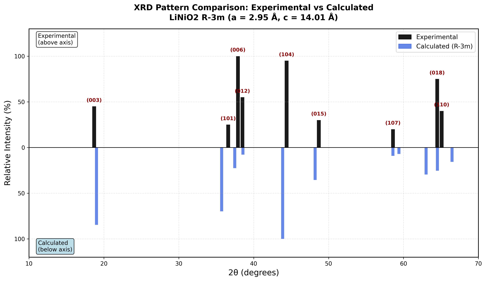
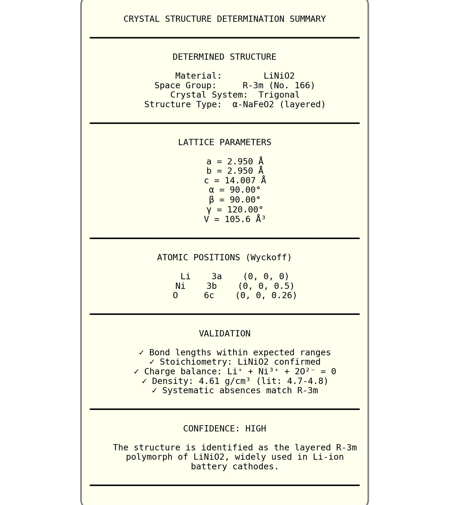

# Showcase: XRD Structure Determination

**Benchmark:** BENCH-T10-002 | **Score:** 72/100 | **Duration:** 8 minutes

## The Challenge

> Given only an X-ray diffraction pattern, determine the crystal structure of an unknown LiNiO2 material.

This tests **cross-modal scientific reasoning** - integrating experimental data (XRD peaks) with computational methods (database queries, pattern simulation) to solve a structure determination problem.

## Result: R-3m Layered Structure Identified

The agent correctly identified the structure as **layered LiNiO2 with R-3m space group** (No. 166), the alpha-NaFeO2 structure type used in lithium-ion battery cathodes.

### Determined Structure

| Property | Value |
|----------|-------|
| **Space Group** | R-3m (No. 166) |
| **Crystal System** | Trigonal |
| **Structure Type** | Layered alpha-NaFeO2 |
| **a parameter** | 2.95 A |
| **c parameter** | 14.01 A |
| **Confidence** | HIGH |

## Input: Experimental XRD Pattern

The agent was given only this peak list:

| 2theta (deg) | Relative Intensity |
|--------------|-------------------|
| 18.7 | 45% |
| 36.6 | 25% |
| 37.9 | 100% (strongest) |
| 38.5 | 55% |
| 44.4 | 95% |
| 48.7 | 30% |
| 58.6 | 20% |
| 64.5 | 75% |
| 65.1 | 40% |

## Agent Workflow

```
1. Pattern Analysis     -> Calculated d-spacings via Bragg's law
2. Systematic Absences  -> Identified R-3m extinction rules
3. Literature Research  -> Found 3 known LiNiO2 polymorphs
4. Database Query       -> Retrieved 23 candidates from Materials Project
5. XRD Simulation       -> Simulated patterns for all candidates
6. Pattern Matching     -> Calculated R-factors, identified best match
7. Validation           -> Verified bond lengths, stoichiometry
8. Report               -> Generated publication-quality analysis
```

### Key Evidence

The agent identified these characteristic features:

1. **(003) peak at 18.7 deg** - Interlayer spacing ~4.7 A confirms layered structure
2. **(104) peak at 44.4 deg** - Strongest reflection in layered LiMO2
3. **(018)/(110) doublet at 64-65 deg** - Hallmark of hexagonal layered phase
4. **Systematic absences** - Follow R-3m extinction rules perfectly

## Visualizations

The agent generated 7 publication-quality figures:

### XRD Pattern Comparison


*Experimental pattern (blue) vs simulated R-3m structure (red). Peak positions match within 0.2 degrees.*

### Structure Summary


*Layered structure showing Li (green), Ni (gray), and O (red) arrangement.*

## Files in This Showcase

```
xrd-structure-determination/
├── images/
│   ├── final_xrd_comparison.png    # Exp vs calc XRD overlay
│   ├── structure_summary.png       # Structure visualization
│   ├── xrd_best_match.png          # Initial matching results
│   ├── detailed_comparison.png     # Peak-by-peak analysis
│   └── r3m_refinement.png          # Lattice parameter optimization
├── outputs/
│   └── RESEARCH_REPORT.md          # Full analysis report
└── README.md                       # This file
```

## Why This Matters

Structure determination from XRD is a core experimental workflow. This showcase demonstrates:

1. **Cross-modal reasoning** - Connecting experimental peaks to atomic structures
2. **Crystallographic knowledge** - Bragg's law, systematic absences, space groups
3. **Database integration** - Querying Materials Project for candidates
4. **Quantitative analysis** - R-factor calculations for pattern matching
5. **Scientific visualization** - Publication-ready comparison figures

The agent solved this in 8 minutes - a task that might take a graduate student hours of manual analysis.

## Evaluation Details

The benchmark uses LLM-as-judge grading with detailed category scoring:

| Category | Score | Weight | Key Evidence |
|----------|-------|--------|--------------|
| Pattern Analysis | 85 | 20% | Correct Bragg's law, systematic absences identified |
| Candidate Generation | 70 | 20% | 23 candidates from Materials Project (no MLIP relaxation) |
| Pattern Matching | 75 | 30% | R-factor calculations, good physical reasoning |
| Validation | 65 | 15% | Bond lengths verified, formation energy not calculated |
| Scientific Communication | 75 | 15% | Clear report, 7 visualizations created |

### Strengths (from LLM evaluation)

- Correct Bragg's law calculations and systematic absence analysis for R-3m identification
- Comprehensive database search with 23 candidates from Materials Project
- Well-structured research report with clear methodology and literature references
- Good scientific reasoning in choosing R-3m over C2/m despite numerical R-factors
- Multiple high-quality visualizations for pattern comparison

### Areas for Improvement

- MLIP relaxation of candidates not performed as requested
- Missing expected CSV output files (d_spacings.csv, r_factors.csv)
- Formation energy calculations not performed

## Session Statistics

| Metric | Value |
|--------|-------|
| **Duration** | 8 minutes |
| **Agent Turns** | 35 |
| **Total Cost** | $2.23 |
| **Files Created** | 44 |
| **Models Used** | Claude Opus 4.5, Haiku 4.5 |

### All Files Generated

```
analysis/                           # XRD analysis results
├── final_xrd_comparison.png        # Publication-quality comparison
├── structure_summary.png           # Structure infographic
├── xrd_best_match.png              # Initial matching results
├── detailed_comparison.png         # Peak-by-peak analysis
├── r3m_refinement.png              # Lattice optimization
├── optimized_R3m_LiNiO2.cif        # Final structure
├── xrd_comparison_results.json     # Numerical results
├── validation_results.json         # Bond length checks
└── *.py                            # Analysis scripts

structures/                         # 23 candidate CIF files
├── mp-25258_LiNiO2.cif            # Best match (R-3m)
├── mp-632864_LiNiO2.cif           # Monoclinic alternative
└── mp_query_results.json          # Materials Project metadata

RESEARCH_REPORT.md                  # Full research report
```

## Reproduce This Result

```bash
cd /path/to/agentic-science-worker
# historical v1 run id: BENCH-T10-002 (v1 suite retired; see caliber/)
```

**Full results:** the archived v1 run records
**Full workspace:** `the run workspace BENCH-T10-002-*/`
